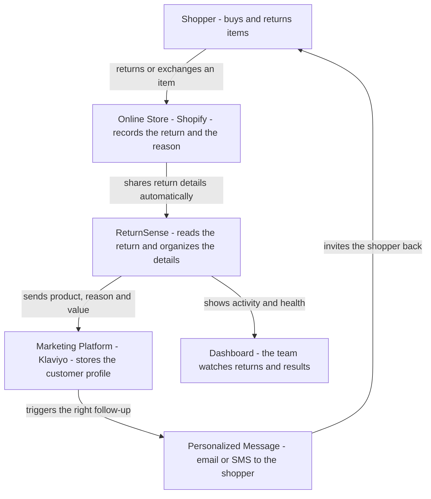

# ReturnSense

> Turn returns into repeat customers.

ReturnSense connects an online store (Shopify) with a marketing platform (Klaviyo) so
that every time a shopper returns or exchanges a product, the store can automatically
respond in a helpful, personal way. Instead of guessing why someone sent an item back,
the store now knows the exact product, the reason (for example "too small" or "arrived
damaged"), and the value of the return. That information flows straight into the store's
marketing tools, so the right follow-up message - a better size suggestion, an apology
with a replacement, or a gentle win-back offer - reaches the customer at exactly the
right moment. In short, ReturnSense turns returns, which are usually a headache, into an
opportunity to keep customers happy and coming back.

## How everything works together



## What the store can do

- Recommend a better size when something was returned for fit.
- Apologize and offer a replacement when a product arrived damaged.
- Suggest smarter alternatives instead of repeating a rejected product.
- Recognize frequent returners and adjust how they are marketed to.
- Watch every return, event, and error from a single dashboard.

A non-technical, client-facing summary lives in
[`docs/project_detail_Klaviyo.md`](docs/project_detail_Klaviyo.md).

---

## For developers

### Monorepo layout

```text
apps/api        Node.js + Express + TypeScript backend (Prisma, Redis/BullMQ)
apps/web        Vite + React + TypeScript dashboard SPA
packages/shared Shared TypeScript types
```

### Prerequisites

- Node.js 20+ and npm 10+
- PostgreSQL 15+ and Redis 7+ (local or Docker)

```bash
docker run -d --name rs-postgres -e POSTGRES_PASSWORD=postgres -e POSTGRES_DB=returnsense -p 5432:5432 postgres:16
docker run -d --name rs-redis -p 6379:6379 redis:7
```

### Setup

```bash
cp .env.example .env          # then fill in secrets (see docs/07-environment-setup.md)
npm install
npm run db:migrate            # create the database schema
npm run db:seed               # optional: seed default return-reason mappings
npm run dev                   # start api + web together
```

- API: http://localhost:4000 (health: http://localhost:4000/api/health)
- Web: http://localhost:5173

### Scripts

| Script | Effect |
| --- | --- |
| `npm run dev` | Run api + web concurrently |
| `npm run build` | Build all workspaces |
| `npm run test` | Run tests |
| `npm run typecheck` | Type-check all workspaces |
| `npm run db:migrate` | Prisma migrate (api) |
| `npm run db:seed` | Seed default mappings |

See [`docs/`](docs/README.md) for architecture, data model, API reference, and the
three-chunk build breakdown.
