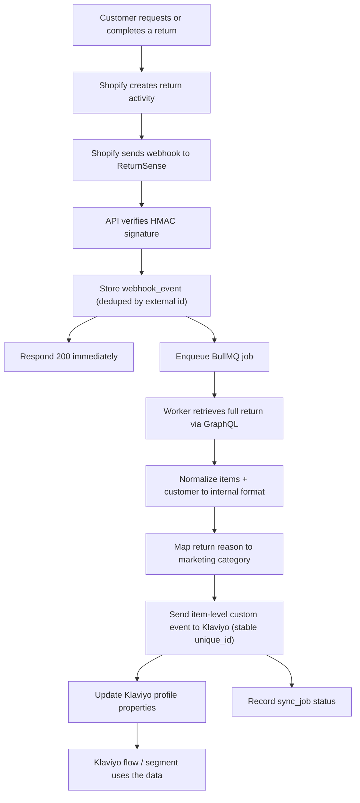
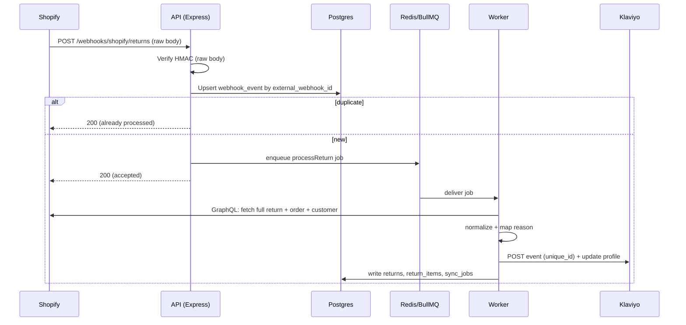

# 01 - Architecture

## Stack

| Layer | Choice | Why |
| --- | --- | --- |
| Monorepo | npm workspaces | No extra tooling; one install, shared types |
| Backend | Node.js + Express + TypeScript | Plain, explicit, modular; easy to reason about |
| ORM / DB | Prisma + PostgreSQL | Typed schema, migrations, relational return data |
| Queue | Redis + BullMQ | Acknowledge webhooks fast, process in background |
| Frontend | Vite + React + TypeScript (SPA) | Fast dev, true React, backend owns all OAuth callbacks |
| Data fetching | TanStack Query | Caching, retries, request state for the dashboard |
| Auth | JWT in httpOnly cookie + bcrypt | Simple, secure session for the dashboard |
| Secrets | AES-256-GCM encryption at rest | Encrypt Shopify/Klaviyo tokens in Postgres |
| Logging | Pino | Structured JSON logs |
| Validation | Zod | Env + request body validation |

## Monorepo layout

```text
klaviyo_connect/
├─ package.json                 # npm workspaces: ["apps/*", "packages/*"]
├─ package-lock.json
├─ .env.example
├─ .gitignore
├─ README.md
├─ docs/
├─ apps/
│  ├─ api/                      # Express + TypeScript backend
│  │  ├─ package.json
│  │  ├─ tsconfig.json
│  │  ├─ prisma/
│  │  │  └─ schema.prisma
│  │  └─ src/
│  │     ├─ main.ts             # server bootstrap (listen)
│  │     ├─ app.ts              # express app assembly (middleware + routes)
│  │     ├─ config/             # env.ts (Zod-validated config)
│  │     ├─ lib/                # prisma.ts, redis.ts, logger.ts, crypto.ts
│  │     ├─ middleware/         # auth.ts, error-handler.ts, raw-body.ts
│  │     ├─ queue/              # queues.ts, workers.ts
│  │     ├─ routes/             # index.ts (mounts every module router)
│  │     └─ modules/
│  │        ├─ auth/
│  │        ├─ organizations/
│  │        ├─ shopify/
│  │        ├─ klaviyo/
│  │        ├─ webhooks/
│  │        ├─ sync/            # normalization + processing engine
│  │        ├─ mappings/
│  │        ├─ returns/
│  │        ├─ notifications/
│  │        └─ dashboard/
│  └─ web/                      # Vite + React SPA
│     ├─ package.json
│     ├─ vite.config.ts
│     ├─ index.html
│     └─ src/
│        ├─ main.tsx
│        ├─ App.tsx
│        ├─ router.tsx
│        ├─ api/                # http client + TanStack Query hooks
│        ├─ components/ui/      # reusable UI primitives
│        ├─ features/           # auth, onboarding, integrations, mappings,
│        │                      #   returns, sync, dashboard
│        ├─ layouts/            # AppLayout, AuthLayout
│        ├─ lib/                # helpers, formatters
│        └─ store/              # auth context / lightweight state
└─ packages/
   └─ shared/                   # TS types shared by api + web
      ├─ package.json
      └─ src/
         ├─ index.ts
         ├─ return.ts           # internal normalized return format
         ├─ klaviyo.ts          # event + profile-property shapes
         └─ api.ts              # request/response DTOs
```

## Module convention (backend)

Every backend module is self-contained and follows the same file layout:

```text
modules/<name>/
├─ <name>.controller.ts   # Express Router; validates input, calls service
├─ <name>.service.ts      # business logic; no Express types
├─ <name>.repository.ts   # Prisma access for this module's tables
├─ <name>.types.ts        # module-local types (imports shared where relevant)
└─ <name>.test.ts         # unit tests for the service
```

Dependencies flow **controller → service → repository**. Services never import Express;
controllers never touch Prisma directly. Cross-module use goes through the other
module's service.

## Feature convention (frontend)

```text
features/<name>/
├─ <Name>Page.tsx         # route-level screen
├─ components/            # feature-specific components
├─ hooks.ts               # TanStack Query hooks calling src/api
└─ types.ts               # feature-local view models
```

## System flow



## Request lifecycle (webhook)



## Deployment (reference, not built in MVP chunks)

- Frontend SPA: any static host (Vercel, Netlify, S3+CloudFront).
- API + workers: a host supporting persistent processes (Railway, Render, AWS ECS).
- Postgres: Supabase, Neon, Railway, or AWS RDS.
- Redis: Upstash, Railway, or a managed Redis.

Locally everything runs via `npm run dev` at the workspace root with Postgres and Redis
available (Docker or local installs). See [07-environment-setup.md](07-environment-setup.md).
