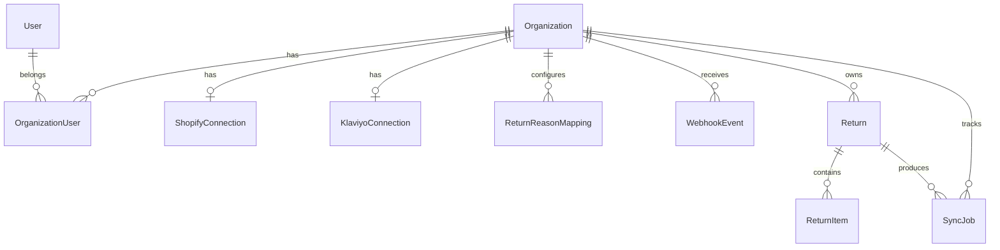

# 02 - Data Model

This document defines the database schema (Prisma), the internal normalized return
format, and the Klaviyo event/profile shapes. Tables are grouped by the chunk that
introduces them.

## Conventions

- All ids are `cuid()` strings unless noted.
- Timestamps are `DateTime` with `@default(now())` / `@updatedAt`.
- Encrypted columns store AES-256-GCM ciphertext (see [05-integrations-klaviyo.md](05-integrations-klaviyo.md)
  and `lib/crypto.ts`), never plaintext tokens.
- Every tenant-scoped row carries `organizationId` and is filtered by it in queries.

## Prisma schema (chunk 1: foundation)

```prisma
model User {
  id           String             @id @default(cuid())
  email        String             @unique
  passwordHash String
  createdAt    DateTime           @default(now())
  updatedAt    DateTime           @updatedAt
  memberships  OrganizationUser[]
}

model Organization {
  id        String             @id @default(cuid())
  name      String
  plan      String             @default("free")
  createdAt DateTime           @default(now())
  updatedAt DateTime           @updatedAt
  members   OrganizationUser[]
}

model OrganizationUser {
  id             String       @id @default(cuid())
  organizationId String
  userId         String
  role           String       @default("owner") // owner | admin | member
  organization   Organization @relation(fields: [organizationId], references: [id], onDelete: Cascade)
  user           User         @relation(fields: [userId], references: [id], onDelete: Cascade)

  @@unique([organizationId, userId])
}
```

## Prisma schema (chunk 2: integrations)

```prisma
model ShopifyConnection {
  id                   String    @id @default(cuid())
  organizationId       String    @unique
  shopDomain           String    @unique
  encryptedAccessToken String
  scopes               String
  status               String    @default("active") // active | uninstalled
  installedAt          DateTime  @default(now())
  uninstalledAt        DateTime?
}

model KlaviyoConnection {
  id                    String    @id @default(cuid())
  organizationId        String    @unique
  accountId             String?
  encryptedAccessToken  String
  encryptedRefreshToken String
  tokenExpiresAt        DateTime?
  scopes                String
  status                String    @default("active") // active | expired | revoked
}

model WebhookEvent {
  id                String    @id @default(cuid())
  organizationId    String
  source            String    // shopify
  topic             String    // returns/approve, refunds/create, ...
  externalWebhookId String    // Shopify X-Shopify-Webhook-Id header
  payload           Json
  status            String    @default("received") // received | processing | processed | failed
  receivedAt        DateTime  @default(now())
  processedAt       DateTime?

  @@unique([source, externalWebhookId])
  @@index([organizationId, status])
}
```

## Prisma schema (chunk 3: processing engine)

```prisma
model ReturnReasonMapping {
  id                String  @id @default(cuid())
  organizationId    String
  sourceReason      String  // e.g. TOO_SMALL
  marketingCategory String  // e.g. SIZE_ISSUE
  isActive          Boolean @default(true)

  @@unique([organizationId, sourceReason])
}

model Return {
  id                 String       @id @default(cuid())
  organizationId     String
  shopifyReturnId    String
  shopifyOrderId     String
  orderNumber        String?
  customerEmail      String?
  status             String       // REQUESTED | APPROVED | COMPLETED | ...
  currency           String
  totalReturnedValue Decimal      @db.Decimal(12, 2)
  returnCreatedAt    DateTime
  rawData            Json
  createdAt          DateTime     @default(now())
  items              ReturnItem[]

  @@unique([organizationId, shopifyReturnId])
  @@index([organizationId, returnCreatedAt])
}

model ReturnItem {
  id                String   @id @default(cuid())
  returnId          String
  productId         String?
  variantId         String?
  sku               String?
  title             String
  variantTitle      String?
  quantity          Int
  reason            String
  marketingCategory String
  returnedValue     Decimal  @db.Decimal(12, 2)
  return            Return   @relation(fields: [returnId], references: [id], onDelete: Cascade)
}

model SyncJob {
  id             String    @id @default(cuid())
  organizationId String
  returnId       String
  returnItemId   String?
  eventType      String    // Item Returned | Item Exchanged | ...
  klaviyoEventId String?
  status         String    @default("pending") // pending | success | failed
  attemptCount   Int       @default(0)
  errorMessage   String?
  processedAt    DateTime?
  createdAt      DateTime  @default(now())

  @@index([organizationId, status])
}
```

## Internal normalized return format

Shopify data is converted into this shape before anything touches Klaviyo. This lives in
`packages/shared/src/return.ts` and keeps Shopify-specific structures out of the rest of
the codebase.

```ts
export interface NormalizedReturn {
  returnId: string;        // shopify return id
  orderId: string;         // shopify order id
  orderNumber: string;
  customer: {
    shopifyCustomerId: string | null;
    email: string | null;
    phone: string | null;
  };
  status: "REQUESTED" | "APPROVED" | "COMPLETED" | "DECLINED" | "CANCELED";
  currency: string;
  totalReturnedValue: number;
  items: NormalizedReturnItem[];
  createdAt: string;       // ISO 8601
}

export interface NormalizedReturnItem {
  productId: string | null;
  variantId: string | null;
  productTitle: string;
  variantTitle: string | null;
  sku: string | null;
  quantity: number;
  returnReason: string;        // raw Shopify reason
  marketingCategory: string;   // mapped category
  returnedValue: number;
}
```

## Klaviyo event shape

Events are item-based, because one return may include several products with different
reasons. Defined in `packages/shared/src/klaviyo.ts`.

```json
{
  "metric": { "name": "Item Returned" },
  "profile": {
    "email": "customer@example.com",
    "external_id": "shopify-customer-id"
  },
  "properties": {
    "return_id": "shopify-return-id",
    "order_id": "shopify-order-id",
    "order_number": "1045",
    "product_id": "product-id",
    "variant_id": "variant-id",
    "product_title": "Classic Jacket",
    "variant_title": "Medium / Black",
    "sku": "JACKET-M-BLK",
    "quantity": 1,
    "return_reason": "TOO_SMALL",
    "return_category": "SIZE_ISSUE",
    "returned_value": 75,
    "currency": "USD"
  },
  "unique_id": "return-id-item-id"
}
```

The `unique_id` must stay identical across retries so the same Shopify activity never
creates duplicate Klaviyo events. Generate it deterministically from
`returnId + returnItemId + eventType`.

## Klaviyo profile properties

Maintained per customer and used for segmentation:

```text
returnsense_total_returns
returnsense_total_returned_items
returnsense_total_returned_value
returnsense_last_return_date
returnsense_last_return_reason
returnsense_last_return_category
returnsense_last_returned_product
returnsense_exchange_count
returnsense_return_rate
returnsense_customer_status
```

`returnsense_return_rate` is only set when reliable purchase and return totals exist; it
is never guessed from incomplete data.

## Default return-reason mapping

Seeded per organization; merchants can edit it.

```text
TOO_SMALL            -> SIZE_ISSUE
TOO_LARGE            -> SIZE_ISSUE
WRONG_COLOR          -> PREFERENCE_ISSUE
DAMAGED              -> PRODUCT_PROBLEM
NOT_AS_DESCRIBED     -> EXPECTATION_PROBLEM
ORDERED_BY_MISTAKE   -> CUSTOMER_CHANGED_MIND
OTHER                -> OTHER
```

## Entity relationships


