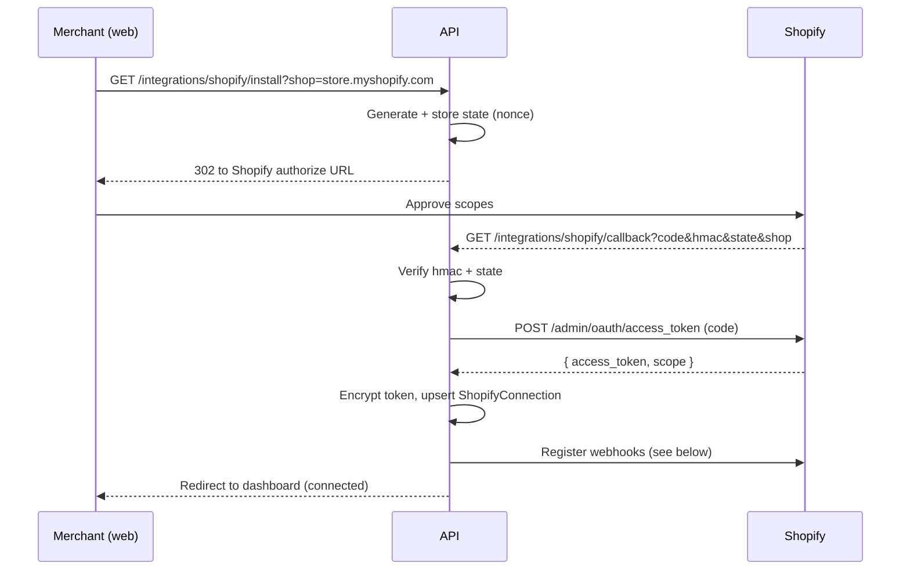

# 04 - Shopify Integration

Handles installation, OAuth, webhook registration, and GraphQL Admin API access. Lives in
`apps/api/src/modules/shopify/`.

## App type and API version

- Build a **Shopify custom/public app** via the Shopify Partner dashboard.
- Pin a specific Admin API version (e.g. `2025-07`) in a constant and use it in every
  GraphQL request URL: `https://{shop}/admin/api/{version}/graphql.json`.
- Required scopes (minimum): `read_orders`, `read_returns`, `read_customers`,
  `read_fulfillments`. Confirm the return scopes are enabled for the pinned version.

## OAuth flow



Implementation notes:

- Verify the callback `hmac` by computing HMAC-SHA256 over the sorted query string with
  the app secret; reject on mismatch.
- Validate `shop` matches `*.myshopify.com` before any request.
- Store the token via `lib/crypto.ts` (AES-256-GCM) in `encryptedAccessToken`.

## Webhook registration

After token exchange, register webhooks pointing at the public API URL
(`APP_URL/api/webhooks/shopify/...`). Register at minimum:

```text
returns/request      -> /webhooks/shopify/returns
returns/approve      -> /webhooks/shopify/returns
returns/decline      -> /webhooks/shopify/returns
returns/cancel       -> /webhooks/shopify/returns
returns/close        -> /webhooks/shopify/returns
refunds/create       -> /webhooks/shopify/refunds
app/uninstalled      -> /webhooks/shopify/app-uninstalled
```

Available return topics depend on the pinned API version; verify each topic exists for
your version and adjust. If a return topic is unavailable, fall back to
`refunds/create`, which can carry associated return info.

## Webhook verification (receiving)

- Register a raw-body parser for webhook routes only (`middleware/raw-body.ts`) so the
  HMAC is computed over exact bytes.
- Verify `X-Shopify-Hmac-Sha256` = base64 HMAC-SHA256(rawBody, appSecret).
- Read `X-Shopify-Webhook-Id` for the dedup key and `X-Shopify-Topic` for the topic.
- Read `X-Shopify-Shop-Domain` to resolve the organization.

## GraphQL: fetch full return

The webhook payload is minimal; the worker fetches the full return by id. The Shopify
`Return` object is associated with an order and exposes return line items, each retaining
a relationship to the original fulfilled line item with processing/refund quantities.

Example query (shape; adapt field names to the pinned version):

```graphql
query GetReturn($id: ID!) {
  return(id: $id) {
    id
    status
    order {
      id
      name
      currencyCode
      customer { id email phone }
    }
    returnLineItems {
      edges {
        node {
          id
          quantity
          returnReason
          returnReasonNote
          fulfillmentLineItem {
            lineItem {
              id
              sku
              title
              variantTitle
              product { id }
              variant { id }
              originalUnitPriceSet { shopMoney { amount currencyCode } }
            }
          }
        }
      }
    }
  }
}
```

For refund-driven flows, query `order(id).refunds` and their `refundLineItems` to obtain
returned quantities and amounts.

## GraphQL client

Implement a small typed client in `shopify.service.ts`:

- `graphql(shop, query, variables)` -> POST with `X-Shopify-Access-Token` (decrypted).
- Handle `throttled` responses / cost limits with exponential backoff.
- Surface a typed error when the token is invalid so the connection can be marked
  needing reconnect.

## Disconnect / uninstall

- `POST /integrations/shopify/disconnect`: mark `status = uninstalled`, set
  `uninstalledAt`, best-effort delete registered webhooks.
- `app/uninstalled` webhook: same effect, triggered by Shopify.

## Manual setup required

See [07-environment-setup.md](07-environment-setup.md) for the Partner account, dev store,
app credentials, and the public tunnel URL needed for local webhook delivery.
