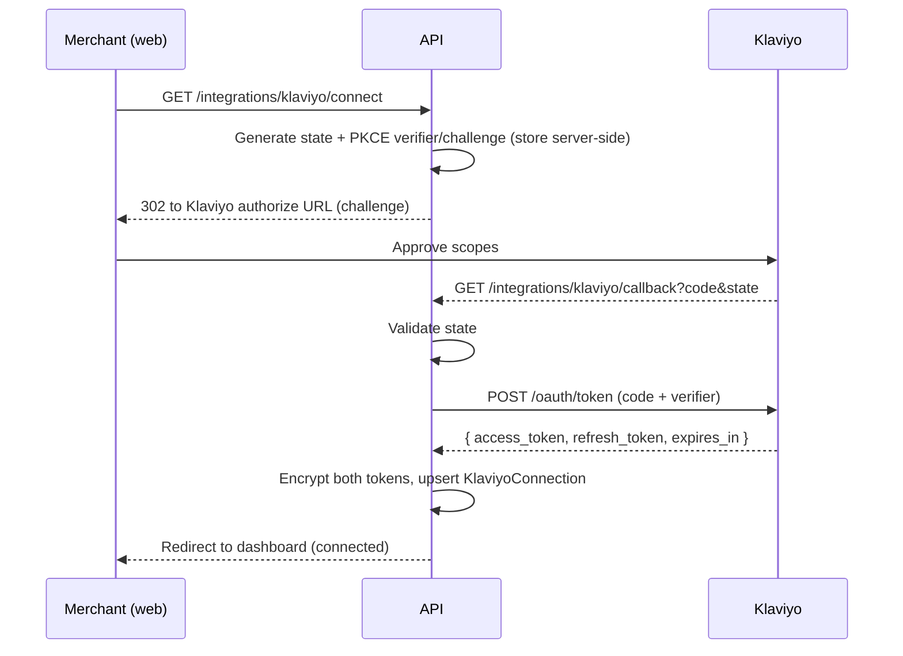

# 05 - Klaviyo Integration

Handles Klaviyo OAuth, token refresh, profile lookup/upsert, and custom event creation.
Lives in `apps/api/src/modules/klaviyo/`.

## App type and API version

- Create a **Klaviyo OAuth application** in the Klaviyo developer settings.
- Pin an API revision via the `revision` header (e.g. `2025-07-15`) on every request.
- Base URL: `https://a.klaviyo.com/api/`.

## OAuth flow (authorization code + PKCE)

Scopes: request the minimum needed to read/write profiles and create events (e.g.
`profiles:read profiles:write events:write metrics:read`). Confirm exact scope strings
in the Klaviyo docs for the pinned revision.

## Token refresh

- Store `tokenExpiresAt = now + expires_in`.
- Before any API call, if the token expires within a small buffer (e.g. 60s), refresh it:
  `POST /oauth/token` with `grant_type=refresh_token`.
- Persist the new access (and rotated refresh) tokens, encrypted.
- On refresh failure (revoked), set `status = expired` and trigger a notification so the
  merchant reconnects.

Wrap this in `klaviyo.service.ts` as `getValidAccessToken(organizationId)` used by every
outbound call.

## Profile lookup / upsert

Match the Shopify customer to a Klaviyo profile using email first, then `external_id`
(Shopify customer id). Use Klaviyo's profile upsert so a missing profile is created:

- `POST /api/profile-import` or `POST /api/profiles` (per revision) with `email` and
  `external_id`.
- Keep the returned Klaviyo profile id if you need it for property updates.

Guard: if the return has no email and no Shopify customer id, record the sync job as
`failed` with a clear message (missing identifier) rather than sending a bad event.

## Custom events

Item-level events via the events endpoint (per revision, typically
`POST /api/events`). Payload maps from the shared Klaviyo event shape in
[02-data-model.md](02-data-model.md):

- `metric.name` = event type (e.g. `Item Returned`).
- `profile` = `{ email, external_id }`.
- `properties` = full item context.
- Set the event's unique identifier to the deterministic `unique_id`
  (`returnId-returnItemId-eventType`) so retries are idempotent. Klaviyo dedupes on this
  stable id.

## Profile property updates

After successful event(s) for a return, recompute and patch profile properties (see the
list in [02-data-model.md](02-data-model.md)) via the profile update endpoint. All custom
properties are namespaced with `returnsense_`.

`returnsense_return_rate` is only written when both purchase and return totals are known
and reliable.

## Rate limiting

Klaviyo enforces per-endpoint rate limits. In the client:

- Respect `Retry-After` on `429`.
- Use BullMQ retry/backoff for transient failures.
- Batch profile-property updates per return (one update per return, not per item).

## Error handling summary

| Situation | Handling |
| --- | --- |
| Token expired, refresh ok | Transparent retry |
| Refresh fails (revoked) | Mark connection `expired`, notify, stop syncing |
| `429` rate limited | Backoff + retry with same `unique_id` |
| Missing customer identifier | Fail sync job with clear message, no event |
| Duplicate delivery | Same `unique_id` -> no duplicate event |
