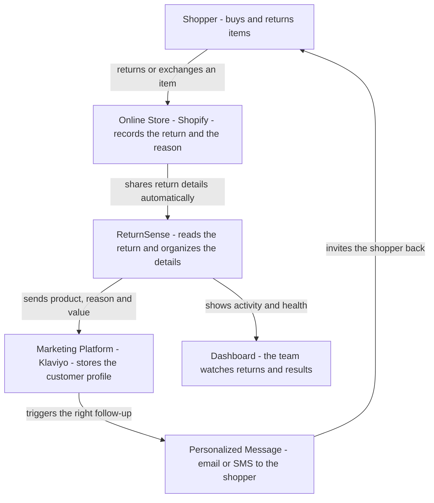

# ReturnSense - Project Overview

## What this project does

ReturnSense connects an online store (Shopify) with a marketing platform (Klaviyo) so
that every time a shopper returns or exchanges a product, the store can automatically
respond in a helpful, personal way. Instead of guessing why someone sent an item back,
the store now knows the exact product, the reason (for example "too small" or "arrived
damaged"), and the value of the return. That information is passed straight into the
store's marketing tools, so the right follow-up message - a better size suggestion, an
apology with a replacement, or a gentle win-back offer - reaches the customer at exactly
the right moment. In short, ReturnSense turns returns, which are usually a headache, into
an opportunity to keep customers happy and coming back.

## How everything works together

## Use case summary

- **The problem:** When a customer returns an item, most stores lose that story. Their
  marketing keeps promoting the same product or size that was just sent back, which
  frustrates shoppers and wastes opportunities.

- **The solution:** ReturnSense quietly listens for every return and exchange, understands
  what happened and why, and hands that insight to the store's marketing platform in real
  time.

- **What the store can now do:**
  - Recommend a better size when something was returned for fit.
  - Apologize and offer a replacement when a product arrived damaged.
  - Suggest smarter alternatives instead of repeating a rejected product.
  - Recognize frequent returners and adjust how they are marketed to.

- **The result:** Happier customers, smarter marketing, fewer repeat returns, and more
  repeat purchases - all running automatically in the background with a simple dashboard
  for the team to keep an eye on everything.
